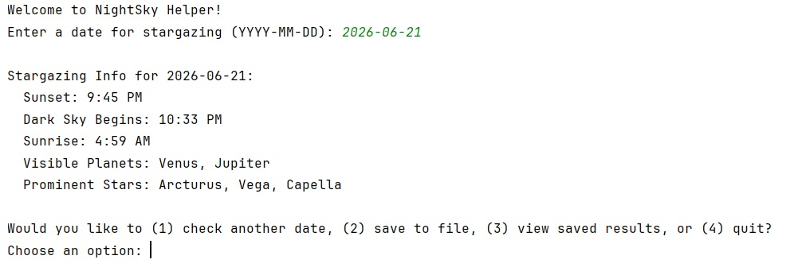

# Denver Nightsky Helper (Python, In Progress, Fall 2025)
Python program using Skyfield (library) to calculate stargazing times and visible celestial objects with CSV export for the Denver area.  

In process, October 2025 (capstone project due 12/7/25).  

**Tech Stack**  

* Python  
* Skyfield library  
* Data structures: Dictionaries, Lists  
* File I/O: CSV  

**Features**  

* Computes sunset, dark sky, and sunrise times for Denver coordinates  
* Identifies visible planets and stars for chosen dates  
* Allows saving results to a CSV log for multi-day trip planning  
* Menu-driven interface with loops and input validation

**Versions**  

* Basic version to run the program in console, available now (Oct 2025) ⬅️
* Full version using OOP and web scraping moon phases coming Dec 2025

**Potential Upgrades**  

* Modification for other location coordinates (this program defaults to Denver, Colorado, USA coordinates)  
* Weather API integration to check for cloud cover or precipitation  
* Moon phase/brightness that might interfere with viewing objects  
* Add a calendar of known celestial events such as meteor showers for additional results output

**Sample Output**  


**Instructor Feedback**  
"Your Nightsky Helper demonstrates excellent understanding of modular program design, function documentation, and file handling. Each core function is clearly written, properly commented, and performs a distinct, single purpose. The program structure and pseudocode flow logically from user input to output, and your testing functions show thoughtful attention to verifying correctness. This submission is organized, user-friendly, and demonstrates both technical and creative strength. Excellent job."  

**How to Run**  

```bash  
git clone https://github.com/cvcpatton/nightsky-helper.git  
cd nightsky-helper  
python nightsky-basic.py  
```  

**License**  
MIT License, Copyright (c) 2025 Catherine Patton  

This project was created as part of my programming coursework. Please do not reproduce or distribute without proper credit. For questions about use, contact me.
